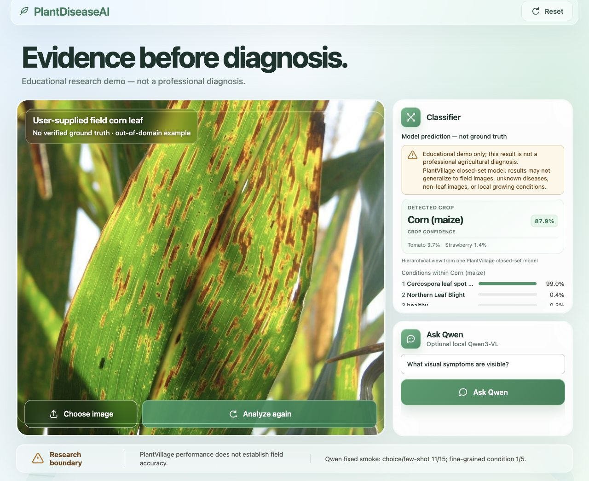

[English](README.md) | [简体中文](README.zh-CN.md)

<p align="center"><strong>PLANTDISEASEAI · AUDITABLE RESEARCH DEMO</strong></p>

# Evidence before diagnosis

PlantDiseaseAI is a reproducible plant-leaf classification research project:
five shared-protocol CNN benchmarks, controlled ablation, error and calibration
analysis, Grad-CAM, a React/FastAPI interface, a Streamlit container interface,
and a deliberately bounded Qwen3-VL smoke branch.



| Test Accuracy | Macro F1 | Models compared |
| ---: | ---: | ---: |
| 0.9953 | 0.9941 | 5 |

> Result boundary: this is one single seed 42 observation on the PlantVillage
> official split. The audit found 227 overlapping `leaf_id` values between train
> and test. It is not evidence of field generalization or professional diagnosis.

## What you can try

| Path | Needs data | Needs checkpoint | Purpose |
| --- | --- | --- | --- |
| Five-minute smoke | No | No | Validate install, data/model/evaluation wiring |
| Local React or Streamlit demo | No | Yes | Try Top-5 prediction and Grad-CAM |
| Full research reproduction | Yes | Trained locally | Recreate audits, training, evaluation, and analysis |

The final checkpoint is not distributed in this repository. Train it from a
tracked configuration or provide a compatible local checkpoint and verify its
hash against `reports/release/week8_rc1_manifest.json`.

## Table of contents

- [Architecture](#architecture)
- [Experimental open-world research](#experimental-open-world-research)
- [Platform support](#platform-support)
- [Prerequisites](#prerequisites)
- [Five-minute smoke test](#five-minute-smoke-test)
- [Train and evaluate on PlantVillage](#train-and-evaluate-on-plantvillage)
- [React + FastAPI demo](#react--fastapi-demo)
- [Streamlit demo](#streamlit-demo)
- [Docker on Linux, macOS, and Windows](#docker-on-linux-macos-and-windows)
- [Optional Qwen panel](#optional-qwen-panel)
- [Reproducibility and evidence](#reproducibility-and-evidence)
- [Known limitations](#known-limitations)

## Architecture

The main data flow is:

```text
image -> OpenCV on original resolution -> lesion location/size/shape/colour
      -> MobileNetV2 crop-only checkpoint -> crop confidence + margin gate
                                         | accepted
      -> ResNet50 disease checkpoint -----+-> selected-crop conditions
                                         +-> disease confidence + margin gate
                                         | accepted: Grad-CAM / optional guidance
                                         | uncertain: diagnosis withheld

React -> FastAPI ----+
                     +-> shared classifier serving layer
Streamlit -----------+

Qwen3-VL (optional context branch; never the classifier truth source)
```

FastAPI exposes the classifier service to React. Streamlit uses the same serving
layer directly, keeping checkpoint loading, preprocessing, Top-5, and Grad-CAM
consistent across interfaces. Qwen is optional context, not a source of
classifier ground truth. See the [complete module map](docs/project-architecture.md).

## Experimental open-world research

The existing React demo is deliberately a PlantVillage closed-set system. A new,
isolated research scaffold now addresses the failure mode where an unknown grape leaf
is forced into Tomato and then receives a Tomato disease label:

```text
image -> OpenCV single-leaf cutout + outline quality gate
      -> frozen encoder -> 14-leaf plant identity + unknown rejection
                         -> accepted host -> leaf-constrained lesion boxes/crops
                                          -> host-specific condition model
                         -> unknown host  -> withhold condition
```

The default baseline uses frozen MobileNetV2 embeddings, a small CPU prototype index,
and similarity plus Top-1/Top-2 margin gates calibrated with held-out unknown plants.
The pilot is restricted to the 14 existing crop-leaf groups plus at least six OOD leaf
species; it does not use the full 1,081-species Pl@ntNet taxonomy. OpenCV exports the
isolated leaf, mask, outline features, lesion overlay, and lesion crops before frozen
feature extraction. Adding taxa rebuilds the small index from cached embeddings; it
does not retrain the encoder. This is an expandable leaf catalog, **not** a claim to
identify every plant or non-leaf organ.

A completed low-compute pilot used 896 training, 224 validation, and 448 accepted
official-test leaf inputs. Conditional test Accuracy was `0.9241` and Macro F1 was
`0.9230`; including 21 preprocessing rejections among 469 attempted test candidates,
the pipeline success rate was `0.8827`. These limited, seeded numbers are not directly
comparable to the earlier crop checkpoint and are not OOD or field metrics. See the
[OpenLeaf-14 pilot report](reports/openleaf14_pilot.md).

An internal six-species holdout then tested the rejection protocol without downloading
new data. It reached unknown AUROC `0.7530`, accepted-known accuracy `0.9753` at only
`0.6328` known coverage, and pseudo-unknown false acceptance `0.2083`. This is a weak
internal sanity check—not external OOD evidence—and shows that the MobileNetV2
prototype gate is not ready for deployment. See the
[holdout report](reports/openleaf14_open_set_holdout6.md).

See the [complete OpenLeaf-14 protocol](docs/research/open_world_hierarchical_plant_research.md),
the [configuration](configs/openworld_research.yaml), and the
[manifest example](configs/openworld_manifest.example.jsonl). No Pl@ntNet/PlantWild/
PlantSeg-scale result is claimed yet. The exact synthetic validation boundary is in
the [scaffold evidence report](reports/openworld_research_scaffold.md).

## Platform support

| Capability | macOS Apple Silicon | Linux | Windows 11 + WSL2/Docker Desktop |
| --- | --- | --- | --- |
| Python smoke/train/evaluate | Yes | Yes, CPU/CUDA depends on local PyTorch | Yes through WSL2; native PowerShell is not the audited Python lane |
| React/FastAPI classifier UI | Yes | Yes with a compatible checkpoint | Yes through WSL2 |
| Streamlit container | Apple `container` or Docker | Docker Engine | Docker Desktop with WSL2 backend |
| Qwen MLX panel | Optional, local weights only | No in the current implementation | No in the current implementation |

“Yes” describes the intended interface. Only environments recorded in the
[Week 8 reproducibility report](reports/week8_reproducibility.md) are completed
audit evidence; Linux and Windows rows are not claims of completed platform
audits.

## Prerequisites

- Git.
- Python 3.12.
- [`uv`](https://docs.astral.sh/uv/) for the locked Python environment.
- Node.js and npm for React.
- Docker Engine or Docker Desktop for the Streamlit container.

Run Python commands from the repository root. Windows Python commands are
intended for WSL2. Docker Desktop on Windows must use the WSL2 backend; native
PowerShell is used below only for the container workflow.

## Five-minute smoke test

```bash
git clone https://github.com/panjoel812/PlantDiseaseAI.git
cd PlantDiseaseAI
uv sync --all-groups
uv run plant-smoke --output-dir outputs/smoke/week1 --seed 42 --image-size 32
uv run pytest -q
```

The synthetic smoke creates a small dataset, exercises splitting, model
training, evaluation, checkpoint loading, and inference, and writes evidence to
`outputs/smoke/week1/`. It validates plumbing only. It does not download
PlantVillage or reproduce the reported PlantVillage metrics.

## Train and evaluate on PlantVillage

The pinned loader stores its cache in the Git-ignored `data/huggingface/`
directory. Download and audit the dataset:

```bash
uv run python scripts/download_data.py --cache-dir data/huggingface
uv run plant-audit \
  --cache-dir data/huggingface \
  --output outputs/plantvillage/audit.json
```

The downloader prints split metadata. The audit writes sample, class, image,
duplicate, corruption, and cross-split findings to
`outputs/plantvillage/audit.json`.

First validate the real-data training path with at most 500 samples per split:

```bash
uv run plant-train \
  --config configs/smoke_plantvillage_mobilenet_v2.yaml \
  --cache-dir data/huggingface \
  --output-dir outputs/plantvillage/smoke_mobilenet_v2_seed42 \
  --max-samples 500 \
  --log-every 5
```

This is a pipeline smoke, not a reported performance result. Run the full final
candidate protocol with:

```bash
uv run plant-train \
  --config configs/week3_ablation/09_combo_candidate.yaml \
  --cache-dir data/huggingface \
  --output-dir outputs/plantvillage/week3_ablation/09_combo_candidate_seed42 \
  --log-every 50
```

The run directory contains the resolved configuration, split manifest,
checkpoint, training curve, metrics, and run manifest. Inspect those metrics
and predict one local image:

```bash
uv run plant-evaluate \
  --metrics outputs/plantvillage/week3_ablation/09_combo_candidate_seed42/metrics.json

uv run plant-predict \
  --checkpoint outputs/plantvillage/week3_ablation/09_combo_candidate_seed42/checkpoint.pt \
  --image /path/to/image.jpg \
  --top-k 5
```

`plant-evaluate` displays training-produced metrics; it does not train or
download a model. `plant-predict` prints sorted Top-5 class probabilities.

Error, calibration, and Grad-CAM analysis share predictions and fixed sample
IDs from one checkpoint. Generate those inputs first:

```bash
uv run plant-freeze-samples \
  --checkpoint outputs/plantvillage/week3_ablation/09_combo_candidate_seed42/checkpoint.pt \
  --split-manifest outputs/plantvillage/week3_ablation/09_combo_candidate_seed42/split.json \
  --output-dir outputs/plantvillage/week4_explainability \
  --cache-dir data/huggingface \
  --samples-per-group 6 \
  --top-k 5 \
  --batch-size 64 \
  --device auto \
  --target-layer layer4.2 \
  --progress-every 10
```

Create the error-analysis JSON/report:

```bash
uv run plant-error-analysis \
  --metrics outputs/plantvillage/week3_ablation/09_combo_candidate_seed42/metrics.json \
  --predictions outputs/plantvillage/week4_explainability/predictions.json \
  --output outputs/plantvillage/week4_explainability/error_analysis.json \
  --report reports/week4_error_analysis.md \
  --low-f1-count 8 \
  --confusion-pair-count 10 \
  --high-confidence-threshold 0.8 \
  --high-confidence-error-count 20
```

Create top-label calibration JSON, report, and reliability diagram:

```bash
uv run plant-calibration-analysis \
  --predictions outputs/plantvillage/week4_explainability/predictions.json \
  --output outputs/plantvillage/week4_explainability/calibration.json \
  --report reports/week4_calibration.md \
  --figure reports/figures/week4_reliability_diagram.png \
  --bins 10
```

Create the fixed-sample Grad-CAM atlas, manifest, and report:

```bash
uv run plant-gradcam-atlas \
  --checkpoint outputs/plantvillage/week3_ablation/09_combo_candidate_seed42/checkpoint.pt \
  --frozen-samples outputs/plantvillage/week4_explainability/frozen_samples.json \
  --output-dir outputs/plantvillage/week4_explainability/gradcam_atlas \
  --cache-dir data/huggingface \
  --report reports/week4_gradcam_atlas.md \
  --device auto \
  --target-layer layer4.2 \
  --target-mode predicted \
  --alpha 0.45 \
  --colormap turbo
```

All final metrics remain an official-split, single seed 42 observation. The 227
overlapping `leaf_id` values mean that these outputs are not field
generalization evidence.

## React + FastAPI demo

Train the independent lightweight crop head once after PlantVillage is cached.
It uses balanced crop sampling, a frozen ImageNet MobileNetV2 backbone, and the
official upstream test split; generated weights stay in Git-ignored `outputs/`:

```bash
uv run python scripts/train_crop_classifier.py \
  --cache-dir data/huggingface \
  --output-dir outputs/plantvillage/crop_mobilenet_v2_seed42
```

In terminal 1, start the API from the repository root with both local checkpoints:

```bash
uv run python scripts/run_demo_api.py \
  --checkpoint outputs/plantvillage/week3_ablation/09_combo_candidate_seed42/checkpoint.pt \
  --crop-checkpoint outputs/plantvillage/crop_mobilenet_v2_seed42/checkpoint.pt \
  --device auto \
  --host 127.0.0.1 \
  --port 8000
```

In terminal 2, install the locked frontend packages and start Vite:

```bash
cd frontend
npm ci
npm run dev -- --host 127.0.0.1 --port 5173
```

Open `http://127.0.0.1:5173/`. The bundled field image has no verified ground
truth and is out-of-domain relative to the controlled evaluation. Its visible
output is a model prediction, not field-accuracy evidence.

The result view now follows three explicit stages. OpenCV first measures visible
leaf/lesion evidence on the original upload, using resolution-scaled morphology
and connected-component thresholds; it reports area, count, dominant shape,
coarse colour, distribution, and an overlay, but does not turn those hand-built
measurements into a disease claim. A separate 14-class MobileNetV2 checkpoint
then predicts the plant. The plant must reach 60% probability with a 10-point
margin. Only then are the 38-class ResNet50 outputs filtered to that plant. The
top plant-specific condition must reach 65% conditional probability with a
15-point margin before the API exposes a diagnosis, Grad-CAM, or management
guidance. Rejected condition candidates remain visible as evidence only.

This hierarchy prevents a weak crop guess from becoming a confident but
taxonomically impossible disease result. Both learned models remain PlantVillage
closed-set models; the crop head is independent, but it is **not** open-world
botanical recognition or evidence of field accuracy.

The interface keeps `liquid-glass-react` for restrained material edges and
highlights. It now follows an upload-first vertical flow: the photograph and
Analyze action sit above the generated evidence, and a successful analysis
moves the viewport to fully expanded Classifier and Management guidance panels
below. Result cards use normal document flow instead of hiding evidence inside
nested vertical scrolling; mobile preserves the same upload → classifier →
assistant order. Large surfaces keep zero elasticity, bottom leaf/dew decoration
ignores pointer input and stops under `prefers-reduced-motion`, and the header
mark fuses the supplied Desmos Bézier gesture with the PlantDiseaseAI leaf. The
external SVG remains unchanged and is not required at runtime.

## Streamlit demo

Run the same serving layer in one local Streamlit process:

```bash
uv run streamlit run app/streamlit_app.py \
  --server.address 127.0.0.1 \
  --server.port 8501 \
  --server.headless true \
  -- \
  --checkpoint outputs/plantvillage/week3_ablation/09_combo_candidate_seed42/checkpoint.pt \
  --device cpu
```

Open `http://127.0.0.1:8501/`. See the
[service evidence](reports/week5_demo_engineering.md) and
[model card](reports/model_card.md) for behavior and limitations.

## Docker on Linux, macOS, and Windows

`Containerfile` builds a CPU-only Streamlit image. It does not contain the
checkpoint, PlantVillage data, React development server, or Qwen runtime. The
checkpoint must be supplied through a read-only `/models` mount.

Docker Engine/Desktop execution was not run in this release environment. The
local user chose Apple `container` and declined Docker installation, so the
release evidence preserves `container: not_run`. Windows PowerShell was statically inspected only. See the
[publication decision record](docs/release/publication_decisions.md) for the
explicit verification waiver and publication boundary.

### Build the image

```bash
docker build -f Containerfile -t plantdisease-ai:week8 .
```

### Linux or macOS with Bash

```bash
MODEL_DIR="$(pwd)/outputs/plantvillage/week3_ablation/09_combo_candidate_seed42"
if ! test -f "${MODEL_DIR}/checkpoint.pt"; then
  echo "checkpoint.pt not found: ${MODEL_DIR}/checkpoint.pt" >&2
  exit 1
fi

docker run -d --rm --name plantdisease-ai \
  -p 8501:8501 \
  --mount "type=bind,src=${MODEL_DIR},dst=/models,readonly" \
  plantdisease-ai:week8

curl --fail http://127.0.0.1:8501/_stcore/health
docker logs plantdisease-ai
docker stop plantdisease-ai
```

### Windows PowerShell with Docker Desktop

Use Docker Desktop with the WSL2 backend. Ensure the repository path is shared
with Docker Desktop.

```powershell
docker build -f Containerfile -t plantdisease-ai:week8 .

$ModelDir = (Resolve-Path ".\outputs\plantvillage\week3_ablation\09_combo_candidate_seed42").Path
if (-not (Test-Path "$ModelDir\checkpoint.pt")) { throw "checkpoint.pt not found" }

docker run -d --rm --name plantdisease-ai `
  -p 8501:8501 `
  --mount "type=bind,source=$ModelDir,target=/models,readonly" `
  plantdisease-ai:week8

Invoke-RestMethod http://127.0.0.1:8501/_stcore/health
docker logs plantdisease-ai
docker stop plantdisease-ai
```

### Troubleshooting

- **`checkpoint.pt` is missing:** train or provide it and verify the bind-mount
  source before starting the container.
- **Docker Desktop says “mount denied”:** enable sharing for the source path or
  move the repository and model under the WSL2 filesystem.
- **Port 8501 is occupied:** use another host port, such as `-p 8505:8501`, and
  open port 8505 instead.
- **Health is still starting:** inspect `docker ps` and
  `docker logs plantdisease-ai`, then allow the configured start period.
- **The build downloads large NVIDIA packages:** rebuild from the current
  CPU-only `Containerfile` and confirm `UV_TORCH_BACKEND=cpu`.
- **Apple `container` reports Rosetta/bootstrap errors:** it has separate macOS
  setup and syntax; these are not Docker requirements. See the
  [Apple container audit](reports/week8_reproducibility.md#apple-container-audit).

## Optional Qwen panel

**No automatic download.** Without local dependencies or weights, the React API
returns the verified `ready=false` unavailable state. Browser and API requests
never download Qwen weights.

The assistant now has two deliberately separate modes:

- **Visual evidence:** local Qwen3-VL describes only visible spots, colors,
  shapes, margins, textures, and distributions. Diagnosis, treatment, pesticide
  dose, and regulatory questions are blocked before generation. The API returns
  up to six normalized observation rows; the original model text remains
  available in the closed **Raw response** disclosure for audit.
- **Management guidance:** the user manually chooses OpenAI, Claude, or Gemini.
  The selected cloud provider receives uncertainty-preserving classifier context
  and optional Qwen observations. There is **no automatic fallback** between
  providers.

The current implementation requires Apple Silicon macOS with MLX/Metal and
locally cached `mlx-community/Qwen3-VL-4B-Instruct-4bit` weights. Install and
download only after explicitly accepting that optional runtime and storage:

```bash
uv sync --group vlm
uv run --group vlm hf download mlx-community/Qwen3-VL-4B-Instruct-4bit
```

Restart FastAPI after downloading, then choose **Check again** in React. Linux
and Windows are unsupported by the current MLX implementation. The recorded
experiment is only a 5-image/15-question smoke: choice and few-shot choice
scored 11/15, while the fine-grained condition subset scored 1/5. It is not a
complete VQA evaluation, human audit, or professional diagnosis. No LoRA/QLoRA
training was completed.

For the local demo, open **Management guidance → Configure** and paste a key for
exactly the provider you intend to use. The password field is cleared after the
request. The key is sent to
`POST /api/advice/providers/{provider}/configure`, stored only in locked
FastAPI **process memory**, never returned, and removed by **Clear** or an API
restart. It is never placed in `localStorage`, `sessionStorage`, cookies, URLs,
or Git. A runtime value overrides the matching environment variable only for
that running process; no provider call occurs during configuration.

Environment variables remain the recommended server/deployment path; the
complete blank template is `.env.example`:

```bash
export OPENAI_API_KEY="your-server-side-key"
export OPENAI_MODEL="gpt-5.4-mini"

export ANTHROPIC_API_KEY="your-server-side-key"
export ANTHROPIC_MODEL="claude-sonnet-5"

export GEMINI_API_KEY="your-server-side-key"
export GEMINI_MODEL="gemini-3.5-flash"
```

The browser reads non-secret status from `/api/advice/providers` and submits the
manual choice to `/api/advice/ask`. Do not use `VITE_*_API_KEY` variables because
Vite would embed them in browser code. Cloud calls require network access, valid
provider credentials, and may incur cost. Automated tests use injected local
transports; no paid provider response is claimed as live-tested here.

The website configuration surface is intended for localhost. If the API is
exposed beyond the machine, use HTTPS, authentication, and a proper server-side
secret manager instead of sending credentials over an untrusted connection.

General, conditional management options are allowed. Exact pesticide products,
doses, concentrations, dilution ratios, re-entry intervals, and pre-harvest
intervals are blocked locally and redirected to registered labels and local
plant-health professionals.

## Reproducibility and evidence

- [Final experiment report](reports/final_experiment_report.md)
- [Release-candidate manifest](reports/release/week8_rc1_manifest.json)
- [Claim ledger](reports/release/week8_claim_evidence.json)
- [Model card](reports/model_card.md) and [data card](reports/data_card.md)
- [English paper](paper/out/plantdisease_ai_en.pdf) and
  [Chinese paper](paper/out/plantdisease_ai_zh.pdf)
- [Research-defense presentation](docs/presentation/plantdisease_ai_week8_research_defense.pptx)
- [Presentation chart index](docs/presentation/charts/english-transparent/README.md)
- [Complete artifact index](docs/artifact-index.md)

The [reproducibility report](reports/week8_reproducibility.md) preserves a
historical clean-environment run that passed 226 tests plus its static, package,
CLI, smoke, local-evidence, and Apple-container checks. The refreshed manifest
marks clean reproduction, package, local evidence, and container lanes as
`not_run`; it does not inherit runtime success from a different source commit.

## Known limitations

- The official split has 227 overlapping `leaf_id` values; no entity-isolated
  final protocol has been completed.
- Final candidate metrics come from one seed rather than a multi-seed study.
- Controlled backgrounds dominate PlantVillage, with no external field
  validation.
- No calibrated threshold exists for professional or high-risk decisions.
- The human VQA audit is incomplete.
- No LoRA/QLoRA fine-tuning was completed.
- Grad-CAM is relevance visualization, not causal explanation.
- OpenCV lesion masks are deterministic visible-evidence estimates, not ground
  truth segmentation and not a disease classifier.
- The independent crop checkpoint is trained on balanced PlantVillage crop
  labels. It can reject uncertainty but has no external field validation and
  does not establish open-world botanical identity.

## Repository map

| Path | Purpose |
| --- | --- |
| `configs/` | Versioned data, model, training, benchmark, and ablation configurations |
| `src/plantdisease/` | Shared data, model, training, evaluation, inference, explainability, serving, VLM, and release code |
| `app/` | FastAPI/Streamlit adapters and bundled demo inputs |
| `frontend/` | React/Vite interface |
| `scripts/` | Stable commands and release audits |
| `tests/` | Unit, integration, smoke, UI-contract, and release tests |
| `reports/` | Reports, cards, figures, and release evidence |
| `paper/` | Synchronized English/Chinese LaTeX papers and PDFs |
| `docs/` | Tutorials, architecture, blog, presentation, and artifact indexes |

Generated data, checkpoints, and runs belong under Git-ignored `data/` and
`outputs/`.

## Development checks

Run Python checks from the repository root:

```bash
uv run pytest -q
uv run ruff check .
uv run ty check src/plantdisease app scripts
uv run python scripts/audit_week8_claims.py \
  --config configs/week8_claims.yaml \
  --output outputs/plantvillage/week8_release/week8-claims.json \
  --check-links
uv run python scripts/audit_week8_paper.py \
  --zh paper/zh/main.tex \
  --en paper/en/main.tex \
  --claims paper/shared/week8_verified_claims.tex \
  --output reports/release/week8_paper_audit.json
```

Run frontend checks from `frontend/`:

```bash
cd frontend
npm ci
npm run test:run
npm run lint
npm run build
```

## Safety

PlantDiseaseAI outputs are for educational and research use only. They are not
professional plant diagnosis, pesticide, dosage, treatment, regulatory, or
insurance advice. Grad-CAM is a non-causal relevance visualization.

## License

The [MIT License](LICENSE) applies to project code unless otherwise noted. The
supplied field image and its visible reproductions are governed by the separate
[asset license notice](ASSET_LICENSES.md), which does not grant reuse rights.
