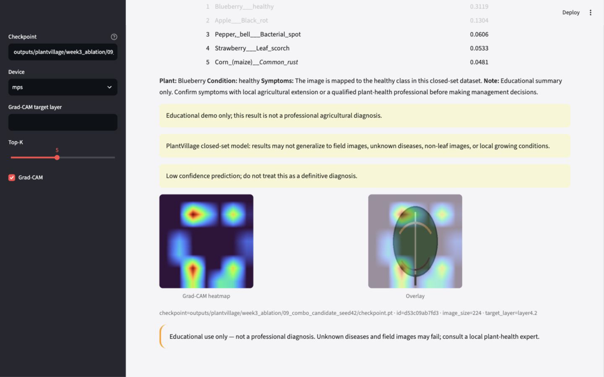
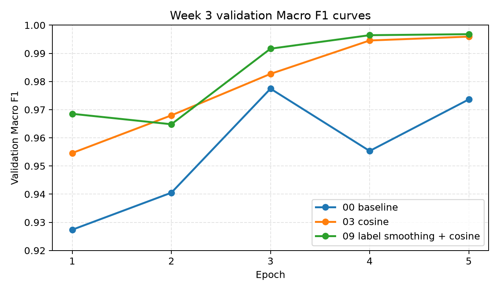
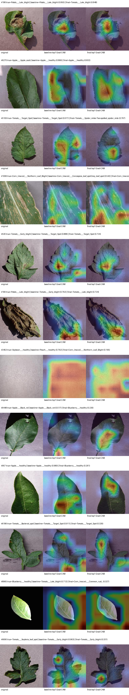
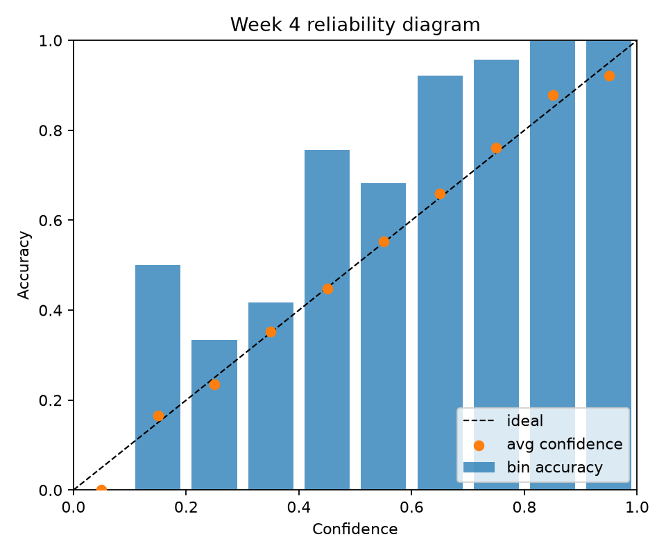
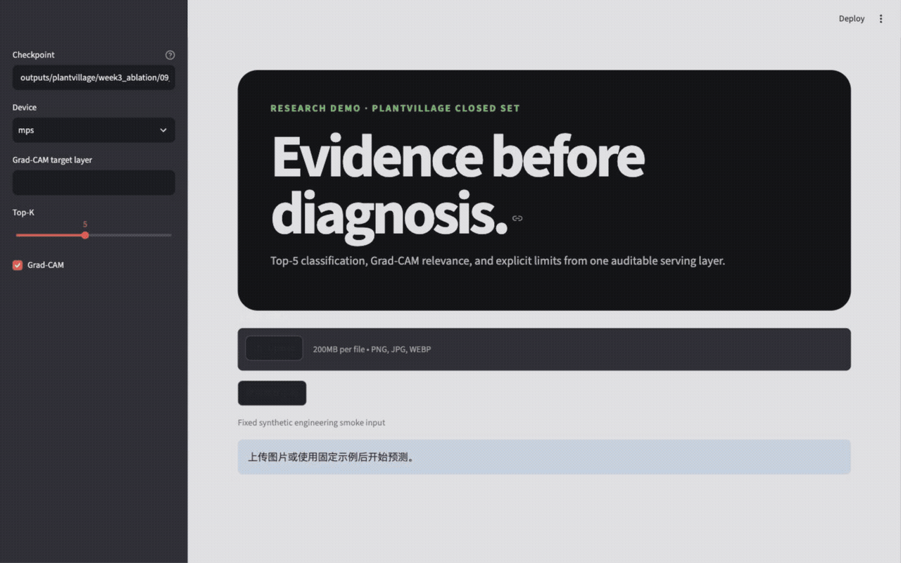

# 从分类器到可解释 Demo：PlantDiseaseAI 的八周农业 AI 工程实践



这不是一篇把模型包装成“植物医生”的文章，而是一份关于证据链的工程记录：分类器是经过统一协议、消融和审计的主线，Demo 让结果可检查，Qwen3-VL 只作为边界明确的小样本探索。

> 本文是 PlantDiseaseAI 的 Week 7 展示稿草案。所有数字都来自仓库内已记录的实验报告或机器可读输出；没有完成的能力会明确写成未完成或探索性结果。

## 1. 为什么做这个项目

农业图像识别项目很容易做成一个“看起来能跑”的 Demo：上传叶片图片，模型给出一个病害名字，再配一个漂亮热力图。但如果想把它作为科研申请、作品集或简历项目，真正困难的部分不是页面，而是证据链：

- 数据是否审计过？
- 训练、评估和推理是否共用同一套标签与预处理？
- 模型选择是否来自公平比较和消融，而不是挑一个最高数字？
- Grad-CAM 是否被正确表述为相关性可视化，而不是因果解释？
- Demo 是否能复现，是否有安全边界？
- VLM 扩展是否诚实地区分 smoke、few-shot、LoRA 和真实可用能力？

PlantDiseaseAI 以 PlantVillage 为起点，目标不是做一个“万能农作物医生”，而是构建一条可审计的农业视觉 AI 项目链路：数据审计、分类器训练、模型 Benchmark、消融实验、可解释性、错误分析、本地 Demo、Apple `container` 部署，以及资源受限的 VLM 探索。


*主线是 PlantVillage 分类器与可审计 serving；Qwen3-VL 分支明确标为探索性 smoke。*

## 2. 数据与第一个关键限制

项目使用 Hugging Face 上的 PlantVillage 数据源，并在本地生成数据审计和 EDA 产物。一个重要发现是：官方 split 中 train/test 存在 `227` 个重叠 `leaf_id`。因此，后续所有使用官方 split 的结果都必须写清楚：这些指标可以用于同协议比较，但不能被表述为严格叶片实体隔离、无泄漏的真实田间泛化结果。

> **Limit** — 官方 split 含 `227` 个重叠 `leaf_id`，不是严格实体隔离结果，也不构成 field（真实田间）泛化证据。

这条限制看似“不利于宣传”，但它反而是项目可信度的一部分。公开材料里最危险的不是指标低，而是把有前提的指标写成没有前提。

证据路径：

- `reports/data_audit.md`
- `outputs/plantvillage/audit.json`

## 3. Week 2：统一协议 Benchmark

在相同官方 split、相同评估指标和可比训练协议下，项目比较了 MobileNetV2、ResNet18、ResNet50、EfficientNet-B0 和 EfficientNetV2-S。

核心结论：

- ResNet50 是最佳精度候选：Test Accuracy `0.9830`，Macro F1 `0.9743`。
- MobileNetV2 是默认轻量部署候选：`2.27M` 参数、`0.31G` FLOPs、batch-32 吞吐 `644.3 img/s`。

这一步的价值不只是得到一个最高分模型，而是建立了“性能—效率”取舍：如果目标是科研分析，ResNet50 更合适；如果目标是轻量部署，MobileNetV2 更有优势。

证据路径：

- `reports/week2_benchmark_progress.md`
- `outputs/plantvillage/baseline_resnet50_seed42/metrics.json`
- `outputs/plantvillage/benchmarks/mobilenet_v2_seed42.json`

## 4. Week 3：消融实验与最终分类器

Week 3 不直接堆叠所有技巧，而是分别测试 Label Smoothing、Focal Loss、Cosine Scheduler、EMA、RandAugment、Random Erasing、Mixup、CutMix 等因素。

最终选择的分类器是 ResNet50 + Label Smoothing + Cosine Scheduler。seed 42 官方 split 结果为：

- Test Accuracy：`0.9953`
- Macro F1：`0.9941`



> **Evidence** — Test Accuracy `0.9953`，Macro F1 `0.9941`；seed 42、官方 split（审计边界：`official split`）。

选择它的理由不是“最高数字”四个字，而是：

1. Label Smoothing 单变量有效；
2. Cosine Scheduler 单变量有效；
3. 二者组合后没有互相抵消；
4. 相比 Focal Loss、EMA、RandAugment、Random Erasing 等负结果，它的改进方向更稳定、更可解释。

证据路径：

- `reports/week3_ablation_results.md`
- `reports/week3_final_model_decision.md`
- `outputs/plantvillage/week3_ablation/09_combo_candidate_seed42/metrics.json`

## 5. Week 4：可解释性、错误分析与校准

Week 4 的重点是把“模型很准”推进到“模型为什么这样错、哪里可能不可信”。项目完成了：

- 24 个固定样本的 Grad-CAM 图集；
- 错误分析；
- 人工关注区域和错误类型审阅；
- 校准分析；
- baseline/final 同样本 Grad-CAM 对比；
- Grad-CAM 复现性验证；
- Week 1–4 阶段报告一致性审计。

校准分析中，最终分类器的 Accuracy 为 `0.9953`，top-label ECE 为 `0.0965`，MCE 为 `0.3348`，Brier 为 `0.0140`。这些指标提示：即使分类准确率很高，置信度表达也仍然值得单独审计。



*Grad-CAM 展示与预测相关的区域，不提供因果证明。*



*Top-label calibration 需要与高分类准确率分开审阅。*

这里最重要的表述边界是：Grad-CAM 只能作为相关性可视化，不能写成因果解释，也不能写成真实田间泛化证据。

证据路径：

- `reports/week4_stage_report.md`
- `reports/week4_consistency_audit.md`
- `reports/week4_gradcam_atlas.md`
- `reports/week4_error_analysis.md`
- `reports/week4_calibration.md`

## 6. Week 5：从离线模型到 Demo 和 Apple container

Week 5 把分类器封装成 UI 无关的 serving layer，然后接入 Streamlit Demo 和 Apple `container`。Demo 支持：

- 上传图片或使用固定样例；
- Top-5 预测；
- Grad-CAM overlay；
- 疾病知识卡；
- 低置信和非专业诊断提醒；
- 固定样例端到端测试。

Apple `container` 版本也完成了 CPU-only Demo 验证。容器内 fixed（固定）合成样例的单图端到端总时间记录为 `129.8 ms`。这只是一次观察值，不是完整性能 benchmark，但可以证明容器内 Demo 链路可运行。



*固定合成样例的真实界面流程：输入、Top-5、Grad-CAM 与教育用途边界。*

证据路径：

- `reports/week5_demo_engineering.md`
- `outputs/plantvillage/week5_demo/local_e2e.json`
- `outputs/plantvillage/week5_demo/container_e2e.json`
- `app/streamlit_app.py`
- `Containerfile`

## 7. Week 6：VLM 探索，不替代分类器

Week 6 选择 Qwen3-VL 作为 Apple Silicon 上的 VLM 探索方向。项目构建了 24 图 / 72 问的 VQA seed 数据，并验证实体级 split integrity。不过人工逐条审计仍未完成，所以不能把它写成“已完成人工审计数据集”。

真实 Qwen3-VL MLX smoke 使用 5 张 test 图片 / 15 个问题。结果如下：

| Prompt | 总分 | Plant | Health status | Condition | 风险词 |
| --- | ---: | ---: | ---: | ---: | ---: |
| original | 0/15 | 0/5 | 0/5 | 0/5 | 7 |
| short | 10/15 | 5/5 | 5/5 | 0/5 | 2 |
| choice | 11/15 | 5/5 | 5/5 | 1/5 | 0 |
| few_shot_choice | 11/15 | 5/5 | 5/5 | 1/5 | 0 |

这个结果很有意思：短答案 prompt 解决了很多格式问题；choice prompt 进一步减少了自由生成和风险词。但 condition 题最高仍只有 `1/5`，说明问题不只是 prompt 漂移，Qwen3-VL 在这个小样本设置下对细粒度病害条件识别仍然弱。

因此，Week 6 的结论不是“VLM 可以诊断植物病害”，而是：VLM 可以作为探索性问答和交互原型，但分类主线仍然是可靠核心。

证据路径：

- `reports/week6_vlm_prompt_compare.md`
- `reports/week6_vqa_datacard.md`
- `reports/week6_vlm_assistant.md`
- `outputs/plantvillage/week6_vlm/vlm_result_analysis_prompt_compare.json`

## 8. 项目的真实边界

这个项目可以诚实地写成：

- 完成了 PlantVillage 闭集分类的可复现训练、评估、解释和 Demo 工程链路；
- 完成了五模型 Benchmark 和 Week 3 消融；
- 完成了 Grad-CAM、错误分析和校准分析；
- 完成了本地 Streamlit 与 Apple `container` Demo 验证；
- 完成了 Qwen3-VL 小样本 VQA smoke 和安全助手原型。

不能写成：

- 真实田间泛化可靠；
- 官方 split 完全无泄漏；
- Grad-CAM 证明模型因果关注病斑；
- LoRA/QLoRA 已完成；
- VQA 人工审计已完成；
- 系统能提供专业农业诊断或农药剂量建议。

## 9. 复现入口

最小工程验证：

```bash
uv sync --all-groups
uv run pytest -q
uv run ruff check .
uv run plant-smoke --output-dir outputs/smoke/week1 --seed 42 --image-size 32
```

Demo 入口：

```bash
uv run streamlit run app/streamlit_app.py \
  --server.address 127.0.0.1 \
  --server.port 8505 \
  --server.headless true \
  -- \
  --checkpoint outputs/plantvillage/week3_ablation/09_combo_candidate_seed42/checkpoint.pt \
  --device cpu
```

## 10. 总结

PlantDiseaseAI 的价值不只在于最终分类指标，而在于把一个农业 AI 项目从“能跑”推进到“可审计、可解释、可演示、可诚实展示”。它保留了负结果和限制：官方 split 的 `leaf_id` 风险、Grad-CAM 的解释边界、VLM 的 condition 失败、未完成的 LoRA 和人工审计。

这些限制不是减分项。对科研和工程作品集来说，知道自己不能声称什么，和知道自己能声称什么一样重要。

## Evidence checklist

- Results snapshot: `docs/week7_results_snapshot.md`
- Evidence map: `docs/week7_evidence_map.md`
- Artifact index: `docs/artifact-index.md`
- Week 4 stage report: `reports/week4_stage_report.md`
- Week 5 demo engineering: `reports/week5_demo_engineering.md`
- Week 6 prompt comparison: `reports/week6_vlm_prompt_compare.md`
