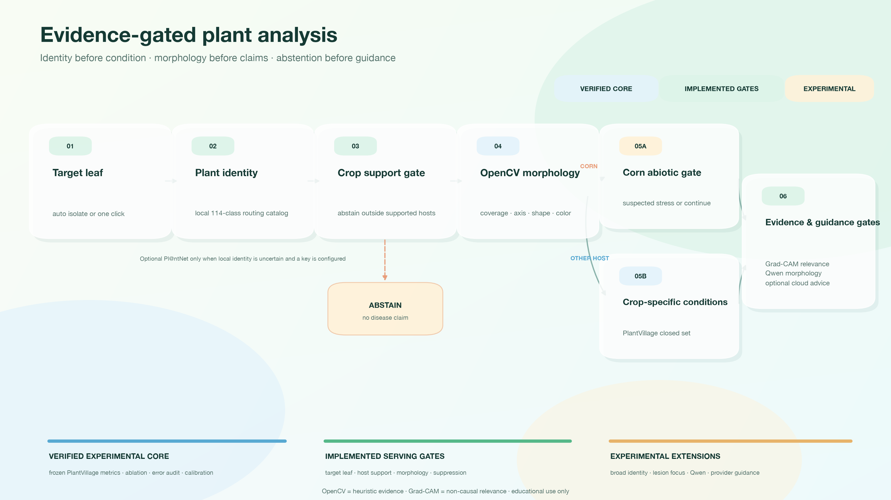
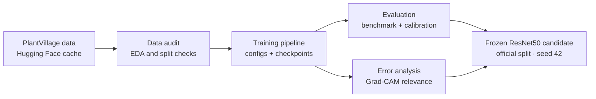
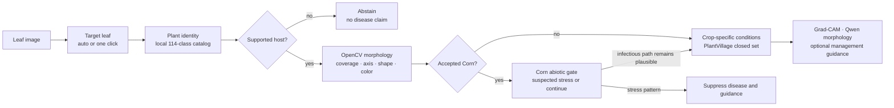

# PlantDiseaseAI Public Architecture and Feature Overview

PlantDiseaseAI is a reproducible plant-leaf classification research project. Its measured
core remains the frozen PlantVillage benchmark, ablation, calibration, error analysis, and
Grad-CAM relevance evidence. The React/FastAPI demo now surrounds that core with target-leaf,
plant-identity, morphology, and abstention gates so unsupported inputs do not automatically
become crop-condition or management claims.

This page is suitable for public project descriptions. It distinguishes measured research
evidence from implemented serving safeguards and experimental extensions; it does not present
the system as professional crop diagnosis.

## Research and serving architecture

The offline research line produces the frozen checkpoint and its auditable evidence:

The online serving line uses the checkpoint only after upstream evidence gates pass:

Local identity is attempted first. Pl@ntNet is an optional broad-identity fallback only when
the local result is uncertain and a key is configured. An accepted identity outside the 14
PlantVillage hosts may be displayed as identity evidence, but it still cannot unlock the
closed-set disease model.

## Evidence levels

### Verified experimental core

- Reproducible Python 3.12 project with `uv`, `pytest`, and `ruff`.
- PlantVillage loading, data/split audits, a shared-protocol five-model benchmark, and
  controlled ablation.
- Frozen ResNet50 candidate evidence on seed 42 and the official split, with the 227
  overlapping-`leaf_id` limitation retained beside the result.
- Error records, calibration analysis, and a fixed-sample Grad-CAM atlas.
- Streamlit and Apple `container` engineering paths using the same serving contracts.

### Implemented serving gates

- Original-resolution target-leaf selection, either automatic or from one normalized
  source-image click.
- Click-seeded GrabCut purity checks that can return `409 leaf_selection_required` before
  model inference.
- Local 114-class identity routing, supported-host abstention, neutral-background disease
  input, and OpenCV lesion/morphology summaries.
- A Corn-only central-axis morphology gate that can suppress infectious outputs and report
  only `suspected_abiotic_nutrient_stress`.
- Management guidance disabled whenever plant, disease, or abiotic evidence does not support
  a disease claim.

### Experimental extensions

- The UCI Leaf100 + PlantVillage 14 identity catalog and optional Pl@ntNet fallback.
- Grape lesion-focus reranking when whole-leaf and lesion evidence conflict.
- Local Qwen3-VL visible-morphology descriptions and manually selected cloud guidance
  providers.

## Main evidence paths

- Frozen classification and demo engineering: `reports/final_experiment_report.md`,
  `reports/week5_demo_engineering.md`
- Target-leaf and Corn-gate QA: `reports/target-leaf-abiotic-qa.md`,
  `reports/metrics/target_leaf_abiotic_qa.json`
- Leaf isolation and hierarchy: `src/plantdisease/serving/leaf_isolation.py`,
  `src/plantdisease/serving/hierarchy.py`
- Lesion-focus implementation: `src/plantdisease/serving/lesion_focus.py`
- Local identity pilot: `reports/openleaf114_local_pilot.md`
- Week 6 VLM smoke: `reports/week6_vlm_experiment.md`
- Container config: `Containerfile`
- Artifact index: `docs/artifact-index.md`

Generated runtime outputs under `outputs/` are local evidence and are intentionally ignored
by Git.

## Public description

PlantDiseaseAI demonstrates an end-to-end agricultural computer-vision workflow: audited
data, reproducible classifier training, comparable experiments, error and calibration
analysis, relevance visualization, evidence-gated serving, and local container execution.
The verified PlantVillage classification line is the measured core. Target-leaf selection,
identity routing, morphology checks, Qwen, and provider guidance extend the demo while
remaining explicitly separated by evidence status.

## Boundaries

- PlantVillage has controlled image conditions; its scores are not field-generalization
  evidence or ground truth for uploaded photographs.
- The local 114-class catalog expands routing choices; it is not validated 114-species
  open-world accuracy.
- OpenCV outputs heuristic regions and morphology measurements, not pathological masks,
  pathogen evidence, or a disease classifier.
- `suspected_abiotic_nutrient_stress` is a safety abstention label, not confirmed nitrogen
  deficiency; nutrient attribution requires soil/tissue tests and local agronomic context.
- Grad-CAM is a non-causal relevance visualization.
- The original user-supplied nitrogen-deficiency image is no longer available in the
  repository, so the gate QA is not an external-image benchmark on that exact file.
- Qwen results are a small smoke study, not LoRA/QLoRA or a professional diagnostic system.
- Pesticide choice, dosage, legal compliance, and high-risk crop actions require local
  plant-protection professionals and local regulations.
