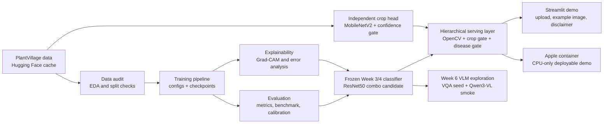

# PlantDiseaseAI Public Architecture and Feature Overview

PlantDiseaseAI is a reproducible plant disease image-classification project built around a
verified classifier, explainability tooling, a local Streamlit demo, Apple `container`
packaging, and a clearly separated Week 6 VLM exploration.

This page is suitable for public project descriptions. It only describes functionality that
has local evidence in this repository, and it does not present the model as professional
crop-diagnosis advice.

## Architecture

## Verified Features

- Reproducible Python 3.12 project with `uv`, `pytest`, and `ruff`.
- PlantVillage data loading, audit reports, EDA outputs, and official split caveats.
- Five-model benchmark using a shared training and evaluation protocol.
- Week 3 ablation study selecting the ResNet50 label-smoothing + cosine-scheduler
  candidate for downstream explanation and demo work.
- Week 4 Grad-CAM atlas, error analysis, calibration analysis, attention review, and
  reproducibility checks.
- Week 5 Streamlit demo with Top-5 predictions, confidence values, Grad-CAM overlay,
  disease knowledge cards, low-confidence warnings, invalid-input handling, and
  non-professional diagnosis disclaimers.
- React/FastAPI hierarchy with original-resolution OpenCV lesion evidence, a
  separately trained 14-class MobileNetV2 crop head, crop and disease abstention
  gates, and management guidance disabled whenever either learned stage is
  uncertain.
- Apple `container` workflow with CPU-only image, healthcheck, fixed-sample end-to-end
  validation, image size record, and one runtime memory sample.
- Week 6 exploratory Qwen3-VL MLX smoke baseline on a small label-grounded VQA seed set.

## Main Evidence Paths

- Week 5 demo engineering report: `reports/week5_demo_engineering.md`
- Demo screenshot: `reports/figures/week5_streamlit_demo.jpg`
- Streamlit app: `app/streamlit_app.py`
- Serving layer: `src/plantdisease/serving/service.py`
- Crop training and QA: `src/plantdisease/training/crop.py`,
  `reports/week8_hierarchical_crop_qa.md`
- Container config: `Containerfile`
- Artifact index: `docs/artifact-index.md`
- Week 6 VLM experiment record: `reports/week6_vlm_experiment.md`

Generated runtime outputs under `outputs/` are local evidence and are intentionally ignored
by Git. Important examples include:

- `outputs/plantvillage/week5_demo/local_e2e.json`
- `outputs/plantvillage/week5_demo/container_e2e.json`
- `outputs/plantvillage/week6_vlm/qwen3_vl_zero_shot_smoke.json`
- `outputs/plantvillage/week6_vlm/qwen3_vl_zero_shot_smoke_short.json`

## Public Description

PlantDiseaseAI demonstrates an end-to-end agricultural computer-vision workflow: audited
data loading, reproducible classifier training, model comparison, ablation, explainability,
error analysis, a local demo app, and containerized execution on Apple Silicon. The verified
classification line is the core project result. The VLM work is an exploratory extension
that tests whether a small local Qwen3-VL model can answer simple label-grounded questions
about fixed PlantVillage images.

## Boundaries

- PlantVillage has controlled image conditions; results must not be treated as field
  generalization evidence.
- Grad-CAM is a relevance visualization, not a causal explanation.
- The crop head and disease model are both PlantVillage closed-set models; the
  crop split improves taxonomy ordering but is not open-world plant recognition.
- The Streamlit demo is educational and should not be used as professional crop diagnosis.
- Week 6 VLM results are small smoke baselines, not LoRA fine-tuning results.
- Pesticide choice, dosage, legal compliance, and high-risk crop actions should be checked
  with local plant-protection professionals and local regulations.
