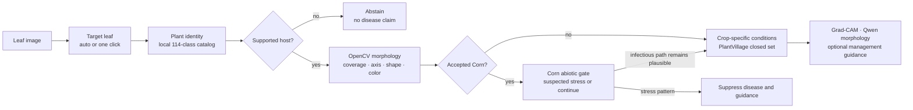

# Open-World Architecture Evidence Sync Implementation Plan

> **For agentic workers:** REQUIRED SUB-SKILL: Use superpowers:subagent-driven-development (recommended) or superpowers:executing-plans to implement this plan task-by-task. Steps use checkbox (`- [ ]`) syntax for tracking.

**Goal:** Synchronize the bilingual paper, bilingual presentation outline, public architecture documentation, and evidence index with the implemented target-leaf, plant-identity, OpenCV morphology, and Corn abiotic-stress gates without changing presentation binaries or frozen experiment metrics.

**Architecture:** Keep the measured PlantVillage classifier as the verified research core and describe the React/FastAPI hierarchy as a serving safety layer around it. Generate one standalone Apple-light architecture asset from repository code, reuse it in the paper and outline, and apply the same three-level evidence vocabulary—verified core, implemented gates, experimental extensions—across every public document.

**Tech Stack:** Python 3.12, Matplotlib, LaTeX/XeLaTeX, BibTeX, Markdown/Mermaid, pytest, existing Week 8 claim and paper audits.

## Global Constraints

- Do not modify any `.pptx` or `.key` file.
- Do not change frozen benchmark metrics or shared claim-macro values.
- OpenCV is heuristic region/morphology evidence, not pathological segmentation.
- The Corn gate may state `suspected_abiotic_nutrient_stress`; it may not diagnose nitrogen deficiency.
- The 114-class catalog is an identity-routing catalog, not a validated 114-species open-world benchmark.
- PlantVillage disease probabilities remain closed-set outputs, not field truth.
- Grad-CAM remains non-causal relevance evidence.
- Qwen describes visible morphology only; management guidance is optional and safety-gated.
- Preserve existing slide binaries, existing user artifacts, and Git history; do not push or delete branches.

---

## File map

- `scripts/generate_hierarchical_architecture.py` — deterministic source for the new SVG and PNG architecture assets.
- `tests/test_hierarchical_architecture_asset.py` — validates generator labels, dimensions, and output formats.
- `docs/media/week8_hierarchical_serving_architecture.svg` — editable vector architecture asset.
- `docs/media/week8_hierarchical_serving_architecture.png` — paper/outline-ready raster export.
- `docs/project-architecture.md` — canonical public module and serving-flow explanation.
- `docs/week7_showcase_architecture.md` — text-readable Mermaid view and evidence-level explanation.
- `README.md`, `README.zh-CN.md` — concise architecture summary and canonical link.
- `docs/artifact-index.md` — artifact status and evidence classification.
- `paper/en/main.tex`, `paper/zh/main.tex` — symmetric paper narrative and architecture figure.
- `paper/README.md` — updated paper scope and build notes.
- `paper/out/plantdisease_ai_en.pdf`, `paper/out/plantdisease_ai_zh.pdf` — rebuilt bilingual papers.
- `docs/presentation/plantdisease_ai_complete_bilingual_outline.md` — updated presentation architecture, demo, limitations, and asset map.
- `docs/presentation/week7_ppt_outline.md` — updated architecture reference only where necessary to prevent contradiction.
- `reports/release/week8_paper_audit.json` — refreshed bilingual structure/claim audit.

### Task 1: Generate the hierarchical-serving architecture asset

**Files:**
- Create: `tests/test_hierarchical_architecture_asset.py`
- Create: `scripts/generate_hierarchical_architecture.py`
- Create: `docs/media/week8_hierarchical_serving_architecture.svg`
- Create: `docs/media/week8_hierarchical_serving_architecture.png`

**Interfaces:**
- Consumes: Matplotlib from the locked project environment.
- Produces: `render_architecture(svg_path: Path, png_path: Path) -> None` and 16:9 SVG/PNG assets containing all canonical-stage labels.

- [ ] **Step 1: Write the failing generator contract test**

```python
from importlib.util import module_from_spec, spec_from_file_location
from pathlib import Path

from PIL import Image


def _load_generator():
    path = Path("scripts/generate_hierarchical_architecture.py")
    spec = spec_from_file_location("hierarchical_architecture", path)
    assert spec is not None and spec.loader is not None
    module = module_from_spec(spec)
    spec.loader.exec_module(module)
    return module


def test_architecture_generator_writes_required_stages(tmp_path: Path) -> None:
    module = _load_generator()
    svg = tmp_path / "architecture.svg"
    png = tmp_path / "architecture.png"
    module.render_architecture(svg, png)
    text = svg.read_text(encoding="utf-8")
    for label in (
        "Target leaf",
        "Plant identity",
        "Crop support gate",
        "OpenCV morphology",
        "Corn abiotic gate",
        "Crop-specific conditions",
        "Evidence & guidance gates",
    ):
        assert label in text
    with Image.open(png) as image:
        assert image.size == (3200, 1800)
        assert image.mode in {"RGB", "RGBA"}
```

- [ ] **Step 2: Run the test and confirm it fails before the generator exists**

Run: `uv run pytest tests/test_hierarchical_architecture_asset.py -q`

Expected: FAIL because `scripts/generate_hierarchical_architecture.py` does not exist.

- [ ] **Step 3: Implement the deterministic Matplotlib generator**

Implement `render_architecture` with a 16×9-inch, 200-DPI canvas; pale blue/green/off-white background; rounded white cards; and three clearly labeled evidence bands. Use this exact ordered stage model:

```python
STAGES = (
    ("01", "Target leaf", "auto isolate or one click"),
    ("02", "Plant identity", "local 114-class routing catalog"),
    ("03", "Crop support gate", "abstain outside supported hosts"),
    ("04", "OpenCV morphology", "coverage · axis · shape · color"),
    ("05A", "Corn abiotic gate", "suspected stress or continue"),
    ("05B", "Crop-specific conditions", "PlantVillage closed set"),
    ("06", "Evidence & guidance gates", "Grad-CAM · Qwen · cloud advice"),
)
```

The footer must contain: `OpenCV = heuristic evidence · Grad-CAM = non-causal relevance · educational use only`.

- [ ] **Step 4: Run the focused test and generate checked-in assets**

Run:

```bash
uv run pytest tests/test_hierarchical_architecture_asset.py -q
uv run python scripts/generate_hierarchical_architecture.py \
  --svg docs/media/week8_hierarchical_serving_architecture.svg \
  --png docs/media/week8_hierarchical_serving_architecture.png
```

Expected: one passing test and two non-empty 16:9 outputs.

- [ ] **Step 5: Inspect the generated PNG at original detail**

Open `docs/media/week8_hierarchical_serving_architecture.png` with the image viewer and confirm every label is readable, connectors do not cross cards, and the two stage-05 branches rejoin only at the downstream evidence gate.

- [ ] **Step 6: Commit the generator and assets**

```bash
git add scripts/generate_hierarchical_architecture.py \
  tests/test_hierarchical_architecture_asset.py \
  docs/media/week8_hierarchical_serving_architecture.svg \
  docs/media/week8_hierarchical_serving_architecture.png
git commit -m "docs: add hierarchical serving architecture asset"
```

### Task 2: Synchronize public architecture and evidence documentation

**Files:**
- Modify: `docs/project-architecture.md`
- Modify: `docs/week7_showcase_architecture.md`
- Modify: `README.md`
- Modify: `README.zh-CN.md`
- Modify: `docs/artifact-index.md`

**Interfaces:**
- Consumes: the Task 1 architecture asset and `reports/target-leaf-abiotic-qa.md`.
- Produces: one canonical public flow and consistent evidence-status vocabulary.

- [ ] **Step 1: Replace the old serving diagram with the canonical hierarchy**

Use the following Mermaid semantics in both architecture documents:



- [ ] **Step 2: Add the three evidence-level definitions and source paths**

Document verified experimental core, implemented serving gates, and experimental extensions. Link the implementation to:

```text
src/plantdisease/serving/leaf_isolation.py
src/plantdisease/serving/hierarchy.py
src/plantdisease/serving/lesion_focus.py
reports/target-leaf-abiotic-qa.md
reports/metrics/target_leaf_abiotic_qa.json
```

- [ ] **Step 3: Update the bilingual README summaries without changing locked numerical claims**

Add a short hierarchy paragraph and link to `docs/project-architecture.md`. State that the 114-class catalog is routing support, not validated 114-species accuracy, and that Corn output is suspected abiotic stress rather than confirmed nitrogen deficiency.

- [ ] **Step 4: Register the new assets and QA report in the artifact index**

Add rows classifying the SVG/PNG as derived presentation media, the generator as reproducible tooling, and the QA Markdown/JSON as implementation evidence.

- [ ] **Step 5: Run claim/link checks**

Run:

```bash
uv run python scripts/audit_week8_claims.py \
  --config configs/week8_claims.yaml \
  --output /tmp/week8-architecture-claims.json \
  --check-links
uv run pytest tests/release/test_public_readme_contract.py tests/release/test_claims.py -q
```

Expected: claim audit status `passed`, zero broken links, and all selected tests pass.

- [ ] **Step 6: Commit public documentation synchronization**

```bash
git add README.md README.zh-CN.md docs/project-architecture.md \
  docs/week7_showcase_architecture.md docs/artifact-index.md
git commit -m "docs: synchronize hierarchical architecture narrative"
```

### Task 3: Update and rebuild the bilingual research paper

**Files:**
- Modify: `paper/en/main.tex`
- Modify: `paper/zh/main.tex`
- Modify: `paper/README.md`
- Modify: `paper/out/plantdisease_ai_en.pdf`
- Modify: `paper/out/plantdisease_ai_zh.pdf`
- Modify: `reports/release/week8_paper_audit.json`

**Interfaces:**
- Consumes: Task 1 PNG and the fixed evidence boundaries from the design spec.
- Produces: symmetric 13-section papers with one added hierarchical-serving subsection and figure.

- [ ] **Step 1: Update the abstract and contribution framing symmetrically**

Add the implemented hierarchy to the engineering evidence but keep all numeric macros unchanged. Use parallel wording:

```text
EN: The React/FastAPI serving path adds target-leaf selection, plant-identity routing,
OpenCV morphology evidence, and abstention gates around the frozen classifier.

ZH: React/FastAPI 服务路径在冻结分类器外围增加目标叶片选择、植物身份路由、
OpenCV 形态证据与拒识门控。
```

- [ ] **Step 2: Add a hierarchical-serving subsection to Section 8**

The subsection must explain: source-coordinate target selection; local 114-class identity routing; optional Pl@ntNet fallback only when configured; supported-host abstention; OpenCV morphology measurements; the Corn central-axis abiotic gate; crop-specific disease output; and suppression of Grad-CAM/knowledge/guidance when upstream evidence fails.

- [ ] **Step 3: Insert the architecture figure with symmetric captions**

Use `../../docs/media/week8_hierarchical_serving_architecture.png` at `0.98\linewidth`. Captions must say that the diagram describes implemented routing and safety gates, not validated open-world accuracy or pathological segmentation.

- [ ] **Step 4: Extend limitations and future work**

Add four limitations: heuristic OpenCV regions, no validated 114-species accuracy, no confirmed nutrient label, and no external-image benchmark using the unavailable original nitrogen-deficiency file. Add future work for expert-labeled abiotic/biotic data and region-supervised evaluation.

- [ ] **Step 5: Refresh paper README scope**

Preserve build commands; add the hierarchical-serving implementation as post-Week-8 engineering evidence and state that frozen benchmark metrics remain unchanged.

- [ ] **Step 6: Run the bilingual paper audit**

Run:

```bash
uv run python scripts/audit_week8_paper.py \
  --zh paper/zh/main.tex \
  --en paper/en/main.tex \
  --claims paper/shared/week8_verified_claims.tex \
  --output reports/release/week8_paper_audit.json
```

Expected: `status=passed`, `section_count_zh=13`, `section_count_en=13`, and no missing claims.

- [ ] **Step 7: Rebuild both PDFs without deleting existing artifacts**

Run the exact XeLaTeX/BibTeX sequence documented in `paper/README.md` for Chinese and English.

Expected: both PDFs rebuild successfully and contain no fatal LaTeX errors.

- [ ] **Step 8: Commit paper sources, audit, and PDFs**

```bash
git add paper/en/main.tex paper/zh/main.tex paper/README.md \
  paper/out/plantdisease_ai_en.pdf paper/out/plantdisease_ai_zh.pdf \
  reports/release/week8_paper_audit.json
git commit -m "docs: update bilingual paper architecture"
```

### Task 4: Synchronize the bilingual PPT outline only

**Files:**
- Modify: `docs/presentation/plantdisease_ai_complete_bilingual_outline.md`
- Modify: `docs/presentation/week7_ppt_outline.md`

**Interfaces:**
- Consumes: Task 1 visual, Task 2 canonical wording, and Task 3 scientific boundaries.
- Produces: bilingual outline copy for architecture, demo, limitations, appendix guardrails, and visual references.

- [ ] **Step 1: Update Slides 4, 9, 24, 25, 32, and 33**

Keep the existing 33-slide structure. Revise only the relevant architecture and safety copy:

- Slide 4: add target-leaf and abstention gates to the engineering contribution.
- Slide 9: separate the frozen semantic source from the new serving hierarchy.
- Slide 24: show the full target-leaf → identity → support → morphology → abiotic/disease branch.
- Slide 25: show the upload-first React demo and guarded outputs.
- Slide 32: add the four new validation gaps.
- Slide 33: describe the system as evidence-gated rather than open-world validated.

- [ ] **Step 2: Update Appendix A11, A12, and the visual master index**

Add target-leaf, hierarchy, lesion-focus, and abiotic-gate test coverage. Add prohibited claims for “validated 114-species accuracy,” “confirmed nitrogen deficiency,” and “OpenCV pathological segmentation.” Replace relevant old Week 7 architecture references with `week8_hierarchical_serving_architecture.png`.

- [ ] **Step 3: Update the Week 7 outline reference without changing a deck binary**

Label the old Week 7 deck image as a historical classifier-first asset and point new architecture discussions to the Week 8 hierarchical asset.

- [ ] **Step 4: Run presentation-outline and claim checks**

Run:

```bash
uv run pytest tests/release/test_week8_presentation_contract.py -q
uv run python scripts/audit_week8_claims.py \
  --config configs/week8_claims.yaml \
  --output /tmp/week8-outline-claims.json \
  --check-links
git diff --name-only | grep -E '\.(pptx|key)$' && exit 1 || true
```

Expected: tests and claim audit pass, and the binary-file scan prints nothing.

- [ ] **Step 5: Commit outline synchronization**

```bash
git add docs/presentation/plantdisease_ai_complete_bilingual_outline.md \
  docs/presentation/week7_ppt_outline.md
git commit -m "docs: update bilingual presentation architecture outline"
```

### Task 5: Render QA, final verification, and local main merge

**Files:**
- Inspect: `paper/out/plantdisease_ai_en.pdf`
- Inspect: `paper/out/plantdisease_ai_zh.pdf`
- Inspect: `docs/media/week8_hierarchical_serving_architecture.png`
- Modify only if necessary: sources already listed in Tasks 1–4

**Interfaces:**
- Consumes: all prior task outputs.
- Produces: visually inspected papers, a clean feature branch, and a local `main` merge.

- [ ] **Step 1: Render both PDFs to page PNGs and contact sheets**

Use the PDF skill renderer and Poppler to render every page. Store temporary QA pages under `/tmp/plantdisease-paper-qa/`; do not delete existing repository artifacts.

- [ ] **Step 2: Inspect every page**

Confirm the new architecture figure is readable, captions remain attached, no text is clipped, and English/Chinese page structures stay aligned. Fix sources and rebuild if any page fails.

- [ ] **Step 3: Run focused and full verification**

Run:

```bash
uv run ruff check scripts/generate_hierarchical_architecture.py \
  tests/test_hierarchical_architecture_asset.py
uv run pytest tests/test_hierarchical_architecture_asset.py \
  tests/release/test_week8_paper_audit.py \
  tests/release/test_week8_presentation_contract.py \
  tests/release/test_public_readme_contract.py \
  tests/release/test_claims.py -q
uv run pytest -q
git diff main...HEAD --name-only | grep -E '\.(pptx|key)$' && exit 1 || true
git status --short
```

Expected: Ruff passes; focused and full test suites pass; no presentation binary appears; the feature branch is clean after the final commit.

- [ ] **Step 4: Commit any final QA corrections**

```bash
git add scripts tests docs paper reports README.md README.zh-CN.md
git commit -m "docs: finalize architecture evidence synchronization"
```

Skip this commit when there are no QA corrections.

- [ ] **Step 5: Merge the completed feature branch into local main**

```bash
git checkout main
git merge --no-ff codex/open-world-plant-research \
  -m "merge: complete open-world plant research"
```

Do not push and do not delete `codex/open-world-plant-research`.

- [ ] **Step 6: Verify the merged local main**

Run:

```bash
uv run pytest -q
git status --short --branch
git log -6 --oneline --decorate
```

Expected: tests pass, local `main` is clean, the merge commit is at `HEAD`, and no remote state has changed.

