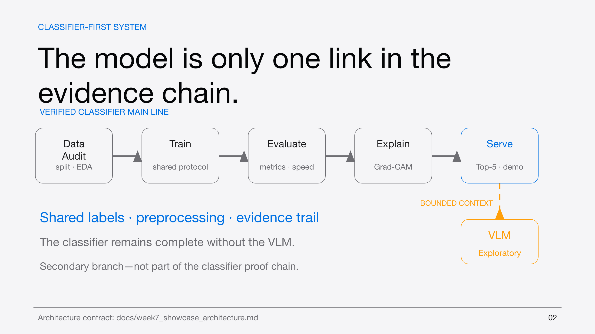
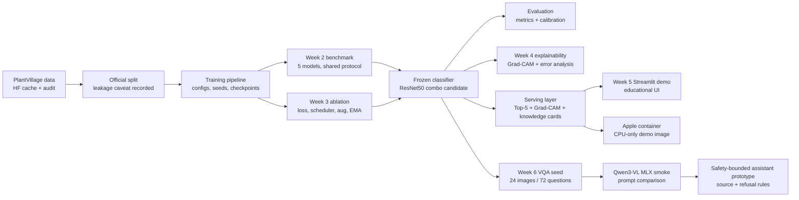

# Week 7 Showcase Architecture

This architecture diagram is intended for README, blog, and PPT use. It shows
the relationship between the verified classifier line, explainability, demo
deployment, and the exploratory VLM branch.

*The PlantVillage classifier is the verified main line; Qwen3-VL is a
secondary, exploratory smoke branch and does not replace classifier evidence.*

## How to explain the branches

- The classifier branch is the project core. It owns the measured classification
  metrics, Grad-CAM, error analysis, and demo inference.
- The deployment branch reuses the same serving layer so Streamlit and Apple
  `container` do not drift from offline inference.
- The VLM branch is exploratory. It uses source-grounded VQA data and Qwen3-VL
  smoke runs to test capability boundaries, not to replace the classifier.
- The assistant prototype is safety-bounded: it uses classifier context,
  provenance, and refusal behavior instead of presenting itself as a professional
  diagnosis system.

## Diagram caption

“PlantDiseaseAI keeps the verified classifier as the central system and routes
explainability, demo deployment, and VLM exploration through auditable evidence
paths. The VLM branch is explicitly exploratory and does not override classifier
results.”
