# Week 7 Showcase Architecture

The Week 7 image below is retained as a historical classifier-first presentation asset.
The maintainable architecture has since expanded to include target-leaf selection,
plant-identity routing, OpenCV morphology evidence, and the Corn abiotic-stress gate.

The current paper and bilingual presentation outline should use the updated hierarchical
serving visual:

*The PlantVillage classifier remains the verified experimental core. Target-leaf and
abstention logic are implemented serving safeguards; broad identity, lesion-focus, Qwen,
and provider guidance remain experimental extensions.*

```mermaid
flowchart LR
    data["PlantVillage data\nHF cache + audit"] --> split["Official split\nleakage caveat recorded"]
    split --> train["Training pipeline\nconfigs, seeds, checkpoints"]
    train --> benchmark["Week 2 benchmark\n5 models, shared protocol"]
    train --> ablation["Week 3 ablation\nloss, scheduler, aug, EMA"]
    benchmark --> select["Frozen classifier\nResNet50 combo candidate"]
    ablation --> select
    select --> eval["Evaluation\nmetrics + calibration"]
    select --> explain["Week 4 explainability\nGrad-CAM + error analysis"]
    select --> leaf["Target leaf\nauto or one click"]
    leaf --> identity["Plant identity\nlocal 114-class catalog"]
    identity --> support{"Supported host?"}
    support -->|no| abstain["Abstain\nno disease claim"]
    support -->|yes| morphology["OpenCV morphology\ncoverage · axis · shape · color"]
    morphology --> corn{"Accepted Corn?"}
    corn -->|yes| abiotic["Corn abiotic gate\nsuspected stress or continue"]
    corn -->|no| disease["Crop-specific conditions\nPlantVillage closed set"]
    abiotic -->|infectious path remains plausible| disease
    abiotic -->|stress pattern| suppress["Suppress disease and guidance"]
    disease --> serve["Serving outputs\nTop-5 + Grad-CAM + knowledge"]
    serve --> streamlit["React / Streamlit demos\neducational UI"]
    serve --> container["Apple container\nCPU-only demo image"]
    select --> vlmdata["Week 6 VQA seed\n24 images / 72 questions"]
    vlmdata --> qwen["Qwen3-VL MLX smoke\nprompt comparison"]
    qwen --> assistant["Safety-bounded assistant prototype\nsource + refusal rules"]
```

## How to explain the evidence levels

- **Verified experimental core:** the frozen classifier owns the measured PlantVillage
  metrics, error analysis, calibration, and Grad-CAM relevance evidence.
- **Implemented serving gates:** one selected leaf, identity routing, supported-host
  checks, morphology measurement, and downstream suppression reduce unsupported claims.
- **Experimental extensions:** the 114-class catalog, Pl@ntNet fallback, Grape lesion
  focus, Qwen morphology, and cloud providers do not extend the verified classifier metric.
- React, Streamlit, and Apple `container` reuse the same serving contracts so UI changes do
  not silently alter checkpoint semantics.

OpenCV masks are heuristic evidence, not pathological segmentation. The Corn branch may
report suspected abiotic/nutrient stress but cannot confirm nitrogen deficiency.

## Diagram caption

“PlantDiseaseAI keeps the verified PlantVillage classifier as the measured core, then
requires target-leaf, plant-identity, crop-support, and morphology evidence before a
crop-condition or management path can open. OpenCV and Grad-CAM remain non-diagnostic
evidence, while broad identity and AI assistants remain experimental.”
